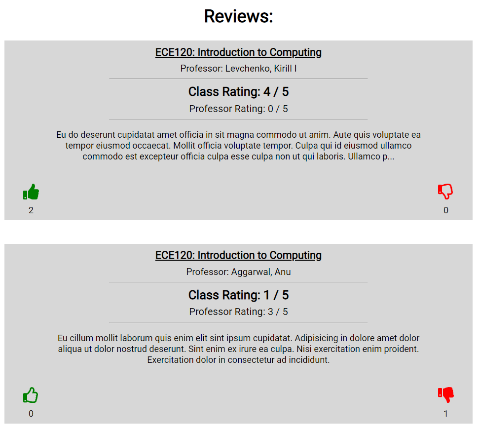

# RateMyCourse-UIUC
A full stack web application for posting ratings/reviews for courses and professors at UIUC.

## Technologies Used:
- MySQL Server hosted on Google Cloud Platform for the database.
- React for the front-end.
- Express / Node for connecting to MySQL.
- Deployed via Google App Engine.

## Features:
- Log in or sign up with a Google account
- View reviews/ratings for any course at UIUC, which get displayed along with the likes/dislikes for the review, and additional key information about the department the course is in
- Like or dislike reviews if they find the review helpful or unhelpful
- Add a new review for a course with the professor that taught the course
- The user can edit or delete any reviews that they have left
- Error handling for when the user inputs null values
- Confirmation when the user adds, edits, or deletes a review
- Confirmation modal to confirm the user wants to delete a review
- Fully responsive / mobile-friendly
- Incorporated advanced MySQL functionality (stored procedure / trigger)

 
 

Note: The website is no longer accessible as credits on Google Cloud Platform have run out.
